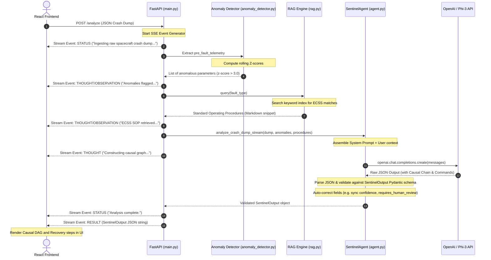

# SENTINEL Backend — Architecture & System Flow

This directory houses the backend service for **SENTINEL (Satellite Safe Mode Recovery & Behavioural Diagnostics)**. The backend is built using **FastAPI** and orchestrates statistical anomaly detection, Retrieval-Augmented Generation (RAG) over aerospace standards, and LLM-powered diagnostics.

---

## 📂 Backend Directory Structure & File Roles

Here is the breakdown of each file inside `sentinel/backend/` and its role:

| File | Purpose / Role |
| :--- | :--- |
| **`main.py`** | **Application Entrypoint**: Defines the FastAPI server, enables CORS middleware, and exposes the HTTP routes (`GET /health`, `GET /scenarios`, and `POST /analyze` SSE stream). |
| **`agent.py`** | **Reasoning Core**: Manages chat completion logic, parses raw LLM output, handles self-repair retries via prompts, and implements the `analyze_crash_dump_stream` SSE generator that yields thoughts, actions, and observations in real time. |
| **`models.py`** | **Data Contract & Validation**: Defines the Pydantic schemas (e.g., `SentinelOutput`, `Hypothesis`, `RecoveryStep`, `SSEEvent`) and enforces strict constraints (e.g., exactly 3 hypotheses, descending confidences, risk checks). |
| **`prompts.py`** | **Prompt Engineering**: Houses the multi-section system prompt (Identity, Subsystems, Thresholds, Safety Rules, Output Schema) and dynamically constructs the user prompt containing crash dumps, anomalies, and RAG context. |
| **`rag.py`** | **Knowledge Grounding (RAG)**: Integrates a lightweight search engine that retrieves corresponding FDIR (Fault Detection, Isolation, and Recovery) guidelines from official European Cooperation for Space Standardization (ECSS) documents. |
| **`scenarios.py`** | **Preset Demo Scenarios**: Provides 3 high-fidelity telemetry scenarios (ADCS Gyro SEU, EPS Power Fault, and OBC Software Hang) for the frontend UI. |
| **`simulator.py`** | **Mock Simulator**: Serves as a simple placeholder for runtime mock telemetry generations. |
| **`evaluator.py`** | **Evaluation Harness**: Placeholder harness for reporting backend performance metrics. |
| **`Dockerfile`** | **Containerization**: Configures the Docker environment to containerize the service (typically deployed to Railway.app or other platforms). |
| **`requirements.txt`** | **Dependencies**: Lists required external libraries (`fastapi`, `uvicorn`, `pydantic`, `python-dotenv`, `openai`). |

### Test Suites
- **`test_models.py`**: Validates Pydantic schema constraints and serialization invariants.
- **`test_prompts.py`**: Ensures all safety gates (e.g. 15% state-of-charge maneuver lock) are present in the system prompt.
- **`test_agent.py`**: Tests self-repair mechanisms, configuration parameters, and LLM parsing.
- **`test_api.py`**: Performs mock integration testing of the FastAPI endpoints and verifies the Server-Sent Events (SSE) stream structure.

---

## 🔄 End-to-End System Flow

Whenever a safe-mode event is analyzed, data traverses a **7-stage pipeline** orchestrated through the backend:



### Detailed Execution Phase Breakdown

1. **Ingestion & Inital SSE Handshake**:
   - The user selects a scenario on the frontend and clicks "Analyze".
   - The frontend triggers a `POST` request to `/analyze` with the crash dump JSON.
   - FastAPI returns a `StreamingResponse` headers (`text/event-stream; charset=utf-8`) and kicks off our background event generator.

2. **Anomaly Filtering (Stage 2)**:
   - The stream invokes the `ZScoreAnomalyDetector` on the `pre_fault_telemetry` list.
   - Any telemetry channel exceeding the $3\sigma$ threshold or reporting `"NaN"` is isolated.
   - The backend streams an `OBSERVATION` event back listing exactly which parameters triggered the warning, cutting down 32,000 telemetry channels to a digestible 5-10 anomalies.

3. **ECSS Procedure Retrieval (RAG Stage 4)**:
   - The `LlamaIndexPipeline` matches the target `fault_type` against standard ECSS operating procedures.
   - The corresponding FDIR protocol is loaded (e.g. Gyro warm reset rules, solar array switchovers) and streamed as a retrieved procedure snippet.

4. **Agent Reasoning & LLM Inference (Stage 3 & 5)**:
   - System prompts and user telemetry datasets are packaged.
   - The agent yields thoughts explaining the causal tracing logic in real time.
   - The backend dispatches a chat request to the LLM. If the output contains invalid schemas (such as the deprecated `component` field name), the agent catches it and automatically retries with a repair prompt explaining the exception to the model.

5. **Serialization, Auto-correction, & UI Render**:
   - Pydantic validates the response against strict mission rules (e.g., if overall confidence is $< 0.70$ or any step is labeled high-risk, the model flags `requires_human_review=True`).
   - The final output is streamed over the socket as a `result` event.
   - The frontend destructures the payload to populate charts, the interactive vis.js Causal DAG, and the step-by-step command checklists.

---

## 🛠️ Setup & Running Instructions

### 1. Installation
Ensure dependencies are installed:
```bash
pip install -r requirements.txt
```

### 2. Environment Setup
Create a `.env` file in the root `sentinel` directory and add your key:
```env
OPENAI_API_KEY=your-api-key-here
```

### 3. Run the Backend API
Start the FastAPI server using Uvicorn:
```bash
uvicorn main:app --reload
```
The API is available at `http://127.0.0.1:8000`.

### 4. Running the Test Suites
Run the python test files to verify models, prompt strings, agent configurations, and api response formats:
```bash
python3 test_models.py
python3 test_prompts.py
python3 test_agent.py
python3 test_api.py
```
